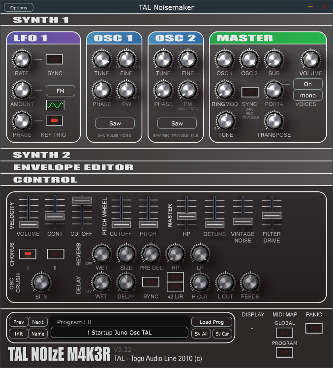

# TAL-Noisemaker-3.22Plus
Additions and enhancements to TAL Noisemaker 3.22 as forked from DISTRHO.  I see the latest windows binary version is 4.22 but I couldn't find the code for it, so I decided to make my revs on this version.  As of writing this, I am fairly new to GitHub, so for now, this will be a stand-alone repository.

## New Features

1. Re-introduced the MIDI Learn button with a difference.  There is a global learn and a program learn.  'Global' will assign the controller for all programs while 'program' will assign just for that program.

How to use MIDI learn
- Decide if you want to assign the controller globally or on the current program.
- Press MIDI Learn (global or program).  The button illuminates.
- Tweak the GUI element you wish to connect to your controller
- Tweak the physical knob/slider on your MIDI device. 
- Observe the GUI control moves now with the physical knob/slider.
- The MIDI Learn light turns off.
- The MIDI controller is now linked this parameter.  This connection is now
saved with the parameters as part of the XML file and is restored when you restart NoiseMaker.
IMPORTANT: if you reverse the order and move the knob before tweaking the GUI, the MIDI learn resets without assigning.

2. Added a screen at the bottom to show the name and number of the current program.  Yeah, this should be part
of the host function, but it's always nice to have this on the GUI editor.

3. Added previous/next buttons to change the program.

4. Added combo box to select program.

5. Added the INIT button to clear the current program.  Always nice for starting from a baseline.  BUT! WARNING! I don't ask "are you sure" so be sure you save using "store parameter" button before using the INIT button!

6. Changed the "store parameter" button so you store ALL the program presets.  Now you can use a XML tool to manage your presets.  On load, if there is only one program, it will be loaded into the current program, just like it used to do.  If there are multiple, it will start loading at program 0 UNLESS you set set the startprogram attribute in the <tal> tag.
example:
<tal curprogram="55" version="1.7" startprogram="3">
will start loading at program 3.

7. Changed midiMap[] array size to 128 since MIDI spec allows for only 128 controllers and this reduces loop times (TalPreset.h has declaration)

8. Removed the arrows from the pulldown combo boxes. These arrows were obscuring the text.  I see this was done for 4.22. 

9. Added program rename button.

10. Added processing of MIDI program change.  If you don't want this, disable program change pass-through from your host.

11. Replaced the factory presets (programchunk.h) with the one from Distrho's 64-bit Linux distribution.  The original ones from the fork were version 1.6 and didn't sound quite like the ones bundled with the Linux distro.

12. Reset back to the factory default by loading a dummy file named factory.noisemakerpreset

## TODO:
-Option to turn off velocity or fix velocity.
-Option to save current program.  That turned out to be a handy thing.
-Use the current directory as the starting point for loading programs.
-I broke the MIDI learn buttons.  This needs to be fixed.

## Modified Panel


## Build Notes

Built with Juce v5.4.3 without using ProJucer.  (There are a few 'deprecated' warnings that I am ignoring for now.)  Note the compile settings below will create a stand-alone application.  You can adjust the Juce declarations to create plugins as desired.

## Building Tal NoiseMaker 3.22+
Here are the compile options I used with gcc++ (Eclipse IDE):
DEBUG STANDALONE VERSION:
```
-DLINUX=1 -DJUCE_APP_VERSION_HEX=0x10000 -DDEBUG=1 -D_DEBUG=1 -DJUCER_LINUX_MAKE_6D53C8B4=1 -DJUCE_APP_VERSION=1.0.0 -DJucePlugin_Build_VST=0 -DJucePlugin_Build_VST3=0 -DJucePlugin_Build_AU=0 -DJucePlugin_Build_AUv3=0 -DJucePlugin_Build_RTAS=0 -DJucePlugin_Build_AAX=0 -DJucePlugin_Build_Standalone=1 -DJucePlugin_Build_Unity=0 -I/usr/include/alsa -I/usr/include/webkitgtk-4.0 -I/usr/include/gtk-3.0 -I/usr/include/libsoup-2.4 -I/usr/include/libxml2 -I/usr/include/at-spi2-atk/2.0 -I/usr/include/at-spi-2.0 -I/usr/include/dbus-1.0 -I/usr/lib/x86_64-linux-gnu/dbus-1.0/include -I/usr/include/gio-unix-2.0 -I/usr/include/cairo -I/usr/include/pango-1.0 -I/usr/include/harfbuzz -I/usr/include/atk-1.0 -I/usr/include/pixman-1 -I/usr/include/freetype2 -I/usr/include/libpng16 -I/usr/include/gdk-pixbuf-2.0 -I/usr/include/glib-2.0 -I/usr/lib/x86_64-linux-gnu/glib-2.0/include -I/usr/include/x86_64-linux-gnu -I../JuceLibraryCode -I../../JUCE/modules -O0 -g3 -Wall -c -fmessage-length=0
```
Use these libraries:
```
-lasound -lfreetype -lX11 -lXext -lXinerama -lwebkit2gtk-4.0 -lgtk-3 -lsoup-2.4 -ljavascriptcoregtk-4.0 -lgdk-3 -lpangocairo-1.0 -lpango-1.0 -latk-1.0 -lcairo-gobject -lcairo -lgdk_pixbuf-2.0 -lgio-2.0 -lgobject-2.0 -lglib-2.0 -lcurl -lGL -ldl -lpthread -lrt
```
 
